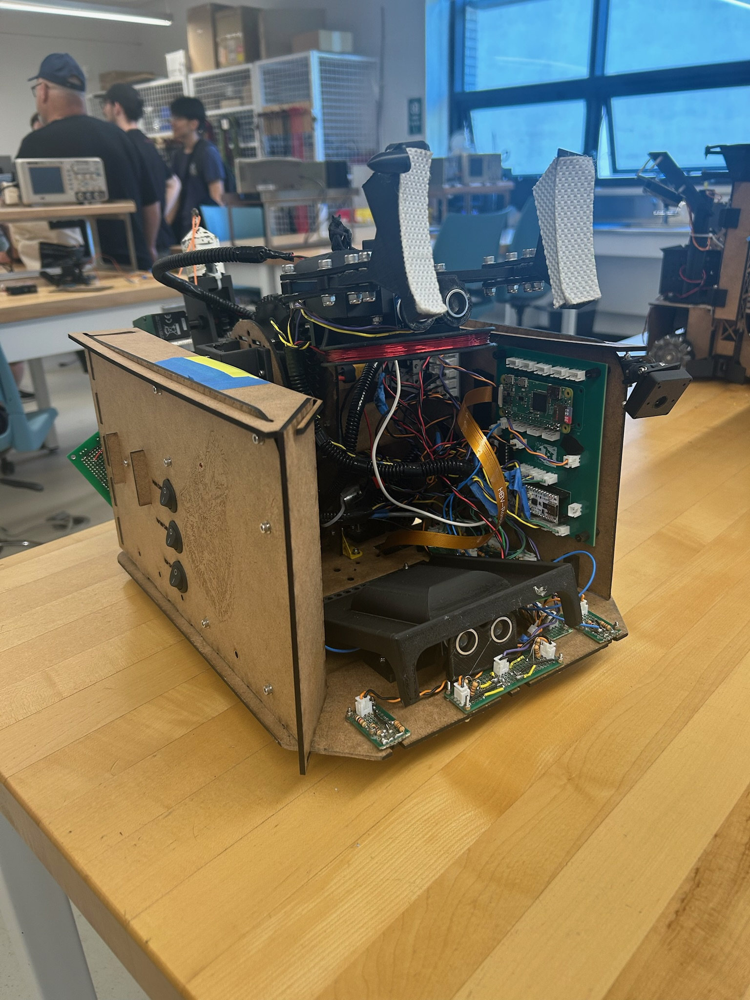
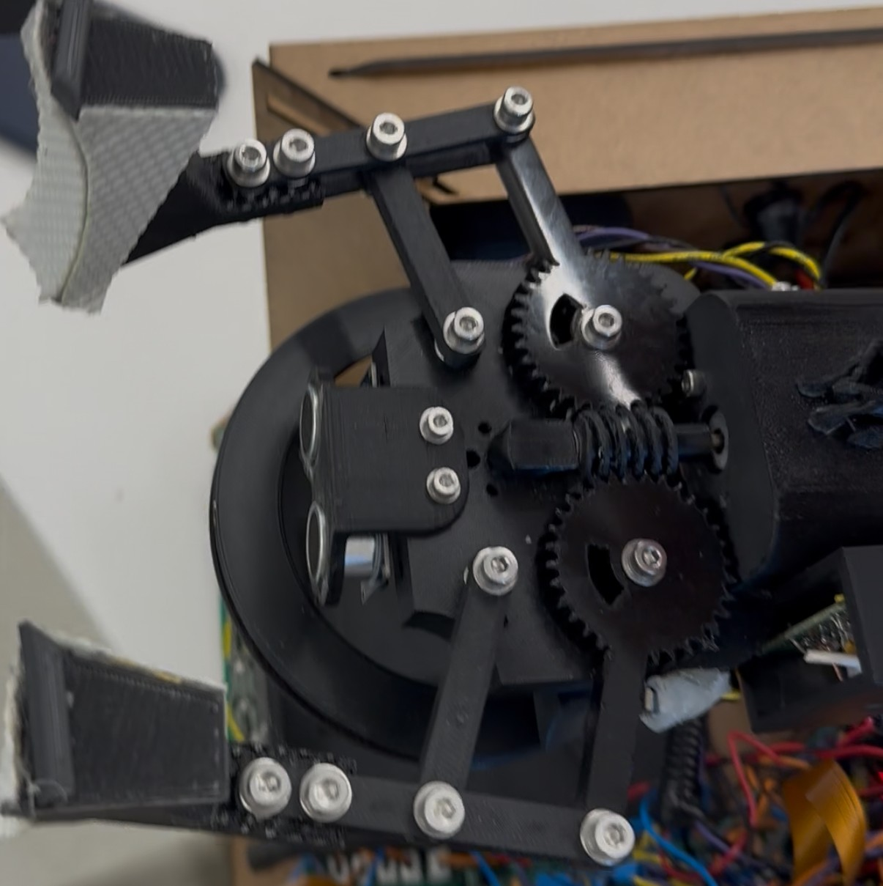
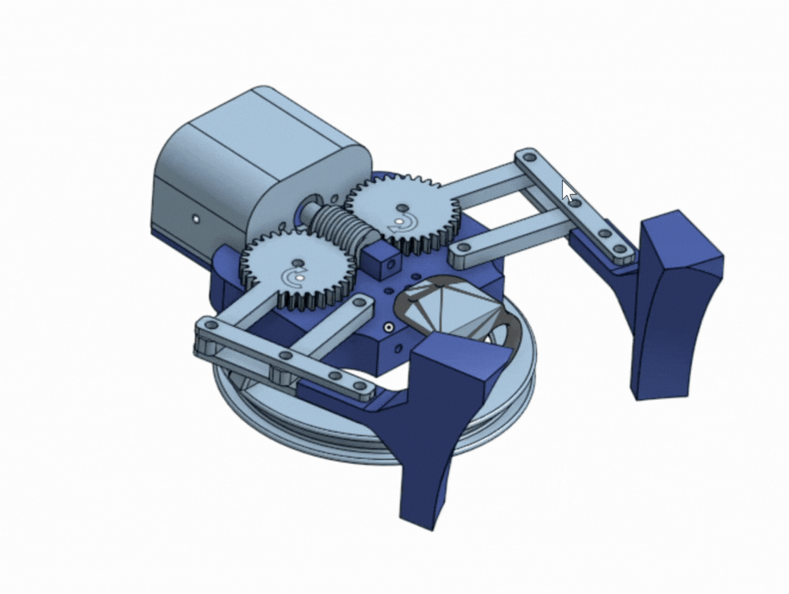

## Ilya Hsieh-Jarov

**Engineering Physics Student** - [LinkedIn](https://www.linkedin.com/in/ilya-hsieh-jarov) | [GitHub](https://github.com/Ijarov) | [Email](mailto:ijarov94@gmail.com)

---

## Technical Summary
Undergraduate Engineering Physics student with hands-on experience in autonomous robotics, mechanical design, embedded firmware, and physical prototyping.

**Core Skills:**
* **Design & CAD:** SolidWorks, KiCad, Rapid Prototyping (3D Printing, Laser Cutting)
* **Software & Embedded:** Java, C, Python, Arduino, Git
* **Fabrication:** Machine Shop Tools (Lathe, Mill, waterjet, MIG weling), Soldering

---

## Featured Projects

### ENPH 253: Autonomous Competition Robot
**Keywords:** Autonomous Robotics | SolidWorks | Custom PCB | C++ / ESP32 Microcontrollers | Prototyping

*Figure 1: Final robot.*

#### Summary
Designed and built a fully autonomous mobile robot as part of a team for a competition requiring course navigation, sensor feedback, and task completion under strict time constraints.

#### Key System Breakdown
* **Mechanical & Chassis:** Modeled complete assembly in SolidWorks. Fabricated laser-cut chassis components and custom mechanical actuators designed for weight reduction and structural integrity.
* **Electronics & PCB:** Designed and assembled custom motor driver circuitry and sensor integration boards using KiCad.
* **Firmware & Control:** Developed low-level firmware in C++ for state-machine execution, closed-loop feedback control, and real-time sensor processing (sonar / optical).

#### Engineering Challenges & Solutions
* **Noise & Signal Interference:** Implemented signal conditioning circuits and software filtering to eliminate sensor jitter during motor activation.
* **Chassis Insulation:** Managed grounding loop considerations by consistently routing power components to power board.

### Subsystem Detail: Mechanical Claw & Gripper Assembly

| Fabricated Physical Claw | Dynamic CAD Motion Assembly |
| :---: | :---: |
|  |  |
|*Figure 2: Bird's-eye view of claw (left).* | *Figure 3: dynamic CAD motion assembly of the gear-driven gripper mechanism (right).* |

#### Mechanical & Fabrication Highlights
* **Actuation & Drive Mechanism:** Designed a worm-spur gear combination to a four-bar linkage to achieve immense opening/closing torque for objective pickup.
* **Structural Material:** Fabricated the primary claw structure out of PLA and acetal for structural rigidity while minimizing cantilevered weight on the robot chassis.
* **Sensing:** A central forward-facing sonar sensor is used for gripping distance. There is a metal detecting coil under the claw base which encapsulates the rock and detects a change in resonance frequency.

#### Troubleshooting
* **The problem:** The 3D printed worm gear would often get jammed, especially at fully open/closed.
* **Possible Culprits:** We suspected that the 3D printed worm gear was coarse and thermally expanded when printing. Therefore, the tolerance became tighter and the gears would not mesh smoothly. Also, at the edge cases, the DC motor would continue to drive at high PWM duty cycles causing any loosely connected arm components to jam up, further contributing to the issue. The motor would not have enough torque to overcome the rough spots.
* **Our Solution:** To prevent the rough spots, we redesigned the worm gear to have much looser tolerance and applied lithium grease. This introduced more play in the claw, but we favoured the increase in reliability. However, the claw would still jam in the fully open position. We implemented a limit switch at the half-open position as this was mechanically optimal and successfully prevented the jamming issues.
---

## Education & Coursework
* **BASc in Engineering Physics** — The University of British Columbia
* **Relevant Coursework:** Systems & Control, Mechanics, Microcomputers, Circuit Design
